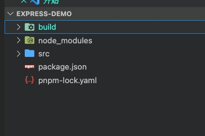
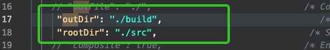
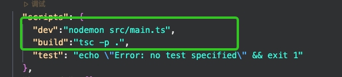
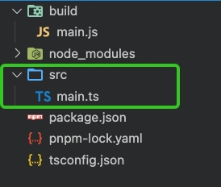
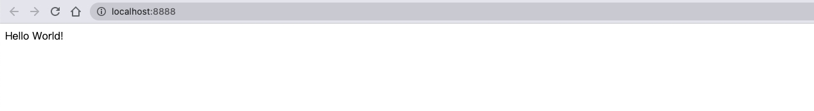

### 1. 首先创建一个目录 （比如 expressDemo ）
### 2. 初始化 package.json
     pnpm init -y
### 3. 然后执行命令安装包
    pnpm install express ts-node typescript nodemon -S
    pnpm install @types/express @types/node  -D  
### 4. 目录结构如下
  
### 5. 创建 tsconfig.json
    tsc --init
### 6. 在 tsconfig.json 设置打包输出文件和根文件
 
### 7. 在 package.json 编写运行脚本 
 
### 8. 在 src 文件下增加一个 main.ts

### 9. 在 main.ts 文件中增加下列代码
``` typescript
    import express, { Application, Request, Response, NextFunction } from 'express'

    const app:Application = express();
    app.get('/', (req:Request, res:Response, next:NextFunction) => {
        res.send('Hello World!');
    });
    app.listen(8888, function(){
        console.log('http://localhost:8888');
    })
```
### 10. 执行命令 pnpm run dev，打开浏览器，看到下图成功。
